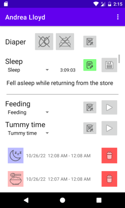

# Login and setup

When you first launch the application you will be presented with the login screen:

Enter the URL to the Baby Buddy server you want to use the app with in the server-address bar. Then add your login name and password and press "login".

_Tip:_ You can try out the app with Baby Buddy's official demo server. Do not put any private information into the app while logged in to the server! The credentials for the server are:

- Server: http://demo.baby-buddy.net/
- Login Name: admin
- Login Password: admin
- Note: The server is _not_ using HTTPS so you need to accept the HTTP warning described below.

## Insecure HTTP connections

You _can_ use an insecure HTTP server to connect to, but if you do, a warning will show advising you against it. It is strongly advised to only use HTTPS-secured servers when logging in over the internet! Your password will not be encrypted when logging in to a server over the internet using HTTP and can therefore easily be stolen. The HTTP-option really only is meant for _local home-network_ installations of Baby Buddy in a home network which are not exposed to the internet.

# Children list

After you logged in to the server you should find the app showing information for a single child in the Baby Buddy database:

You can swipe left and right to switch between multiple children.

If you did not create a child on the Baby Buddy webapp, yet, you will see
"(No children found)" in the title-bar of the app instead. Login to the
web app directly and add children as needed. After you created the children
in Baby Buddy, login back to the Android app and continue.

# Next steps

The app is optimized to make it easier to track times with Baby Buddy and
diaper changes. For details on these topics check the documents

- [Logging Diaper Changes](./diaper.md)
- [Logging times](./logging.md)
