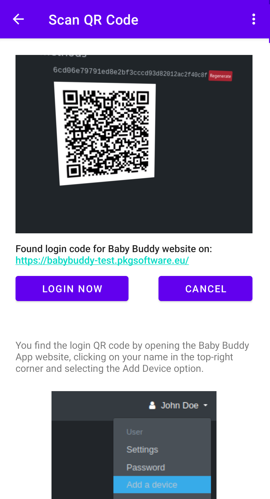
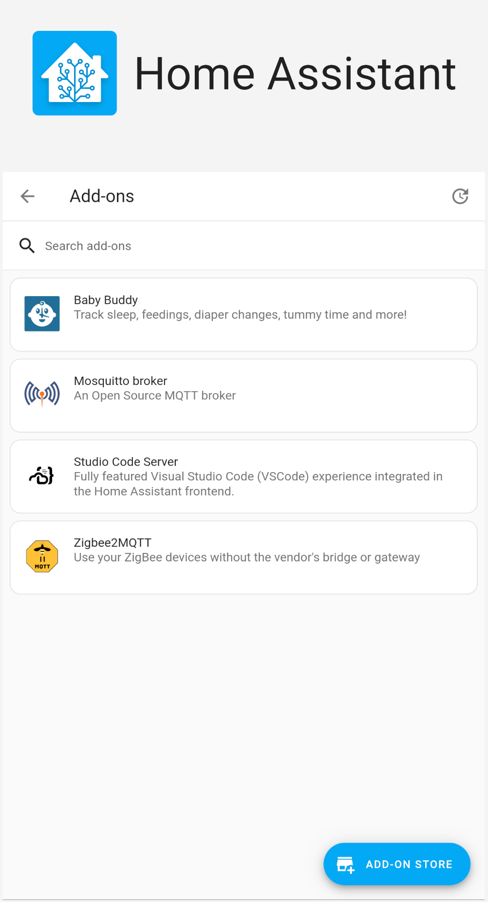
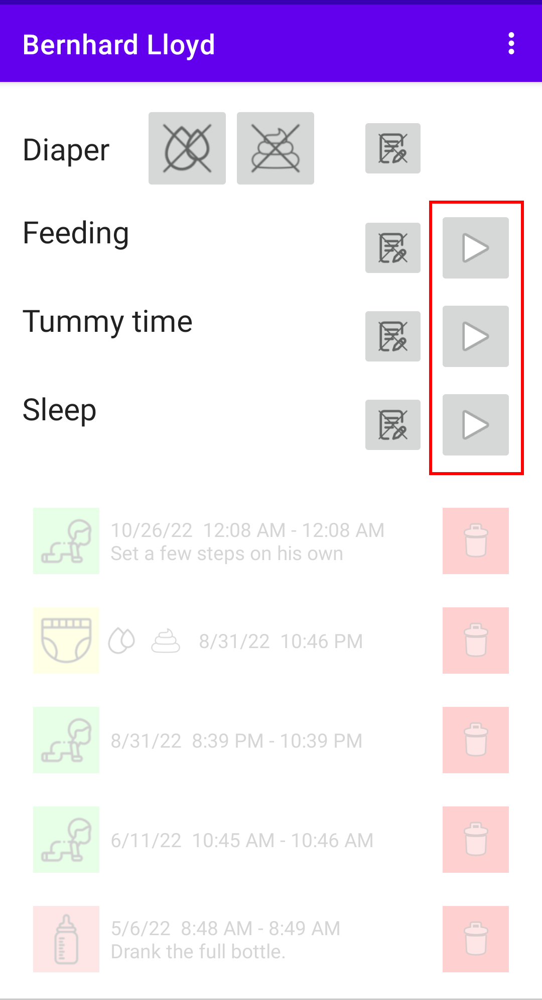
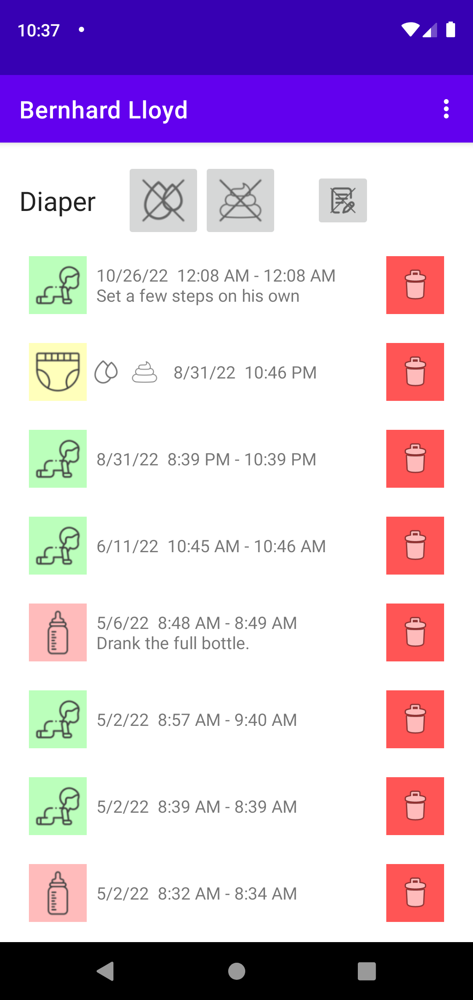

# Logging in

## Login

There are two options for connecting to your Babybuddy server:
Enter your Babybuddy server URL, username, and password. Then press
login to connect the Babybuddy app to the Babybuddy server. Or you choose the
QR Code option (scroll down for details on that option).

## QR Code login

Alternatively, you can login to your Babybuddy Server using a login QR-code. Login to
your Babybuddy Server from another device. Then navigate
via the user menu (top-right) to the "Add a device" page. This is where you find
the login QR-code. Scan the QR-code with the app on your phone. If
scanned successfully, you should get the option to login to Babybuddy
by pressing the "Login now" button.

## Insecure Login

If you use an http-address instead of an https-address, the application will
show you this warning. Only use this feature for local BabyBuddy servers in a
network that you control!

## Home Assistant Ingress

Babybuddy for Android has partial support for logging in
to a Babybuddy server that is hosted on a Homeassistant Ingress-server. You
will need to use the QR-code login option to login to such a server.

# Overview

## Overview

After logging in, you find buttons for logging activities in the upper part of the screen
and a history of recently logged activities in the lower part of the screen.
If you log activities for multiple children, you can swipe horizontally to switch between children.

# Using Timers

## Using Timers

Press the "play"-button to start a timer for the listed activity.

## Using Timers

While the timer is running, you can add notes by pressing the "notes" buttons.

## Using Timers

To stop the timer and store the activity, press the "save" button.

## Feedings

Saving a feeding will trigger a second form, where the feeding type (e.g., solid food) and
method must be entered before the feeding can be stored.

## Other timers

In a previous version of Babybuddy for Android, the app listed an arbitrary
number of timers. Now, by default, only timers for the events that can be tracked
by the app are visible. This was changed to achieve compatibility with
Baby Buddy version 2.0.

# Logging Diapers

## Logging Diapers

The top controls allow logging of diaper changes. Select the type of diaper and press the
"save" button to log the activity. You can optionally add notes.

# Event history

## Event history

The history at the bottom of the screen shows the most recent activities of
the selected child. You can edit entries by pressing the entry in the history for three
seconds. This will open the corresponding page in the BabyBuddy app.
To delete an entry, press the red "delete" button.
